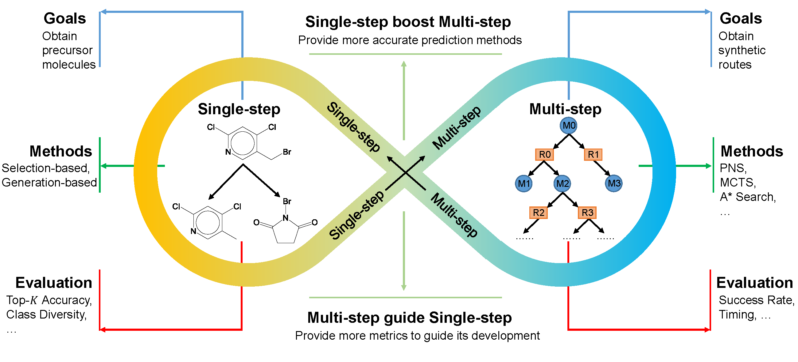

# DeepRetrosynthesis: methods and implementations

 

 [[WIRES](https://wires.onlinelibrary.wiley.com/doi/10.1002/wcms.1694)]
 
This is a repository for AI-based retrosynthesis methods. You can check single-step or multi-step methods and their performance at corresponding folders.

You can find more information in the published article:
Zhong et al's Recent advances in deep learning for retrosynthesis.

## Experiment Settings:
* CPU: Intel(R) Xeon(R) CPU E5-2699 v4 @ 2.20GHz
* Memory: 128 GB
* GPU: NVIDIA GeForce RTX 3090 (24GB)
